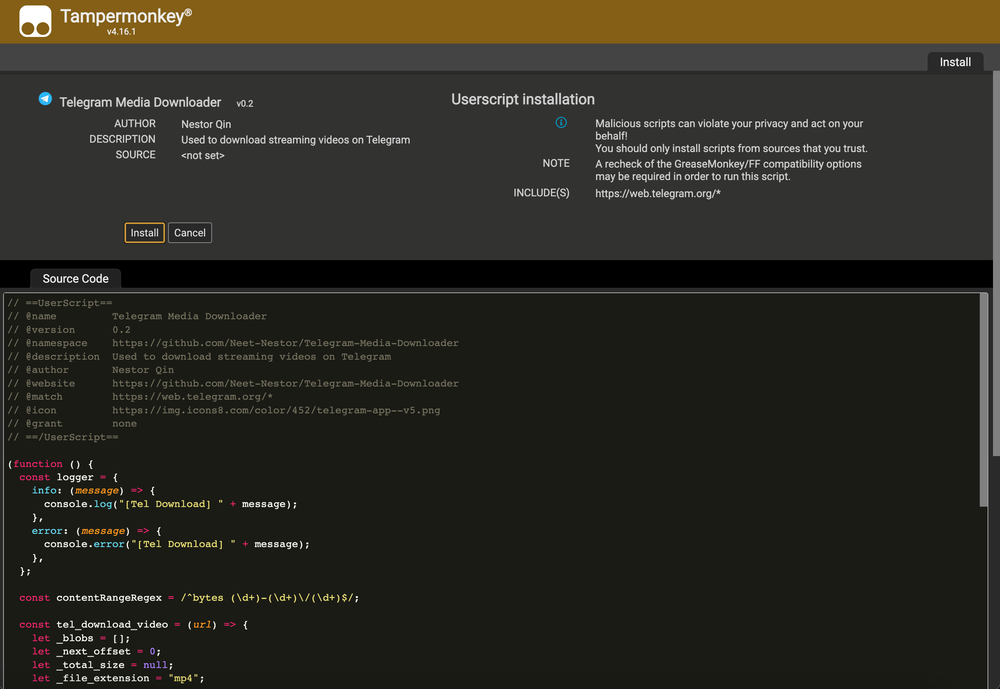
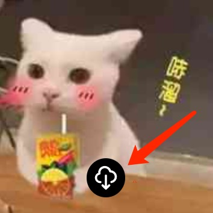
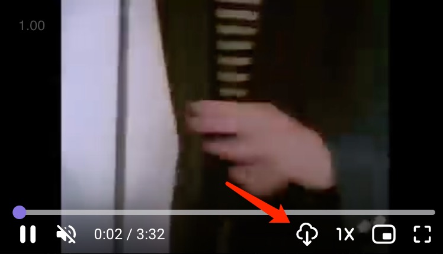

# Telegram Media Downloader
A Tampermonkey script allowing you to download images, GIFs and videos from Telegram web even if the group restricts downloading.

## Installation
### Greasy Fork
1. Install [Tampermonkey](https://www.tampermonkey.net/)
2. Install this script by visiting Greasy Fork:

    https://greasyfork.org/en/scripts/446342-telegram-media-downloader

### Manual install
1. Install [Tampermonkey](https://www.tampermonkey.net/)
2. Open Tampermonkey Dashboard, drag & drop src/tel_download.js into it and clicks "install" button

## Usage
This script will add a download button for every image and video opened on [Telegram Web](https://web.telegram.org/) as shown below.

