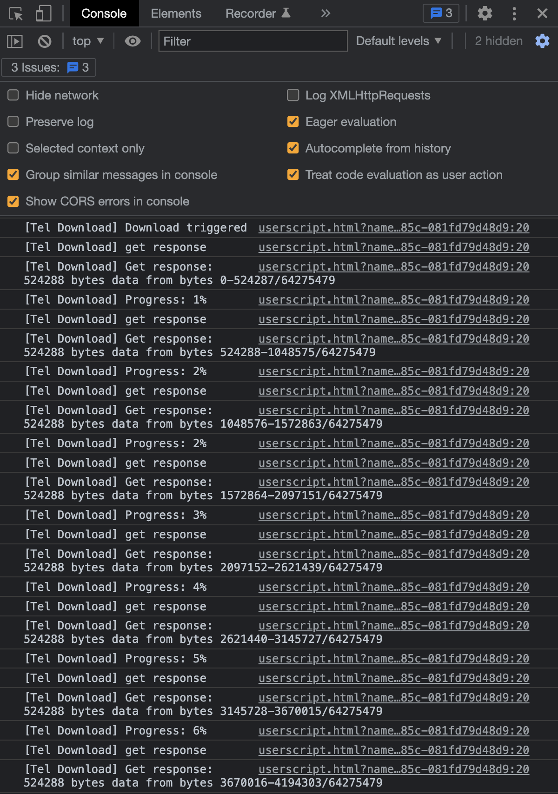

# Telegram Media Downloader
A Tampermonkey script that allows you to download images, GIFs, and videos on the Telegram webapp from private channels which disables downloading and restricts saving content.

## Installation
### Greasy Fork
1. Install [Tampermonkey](https://www.tampermonkey.net/)
2. Install this script by visiting Greasy Fork:
    https://greasyfork.org/en/scripts/446342-telegram-media-downloader

### Manual Installation
1. Install [Tampermonkey](https://www.tampermonkey.net/)
2. Open Tampermonkey Dashboard, drag & drop src/tel_download.js into it and clicks the "install" button

## How to Use
This script only works on Telegram Webapp.

For channels and chats that allow saving content, this script will have no effect. Please just use the official download button provided by the telegram webapp instead.

For channels and chats that disable downloading and restrict saving content, this script will add the download button back for images, GIFs and videos.

The script will silently download files in background, and only after it finishes downloading the entire file the browser will then save the file locally. Therefore, if you are downloading a large video, it's normal that you see nothing happening for a quite a while before the browser starts downloading. To check the downloading progress, refer to [the following instructions](#check-downloading-progress).

### Supported Webapp Versions
There are 2 different versions of telegram webapps:
- https://webk.telegram.org / https://web.telegram.org/k/
- https://webz.telegram.org / https://web.telegram.org/a/

This script should work on both versions of webapp. If you are using another different version of webapp and find this script does not work, please raise an issue to our [GitHub repo](https://github.com/Neet-Nestor/Telegram-Media-Downloader/issues). 

### Check Downloading Progress
If you would like to check the current downloading progress, you can [open browser DevTools -> console](https://developer.chrome.com/docs/devtools/open/) and check the text output.

## Support Author
If you like this script, you can support me via [Venmo](https://venmo.com/u/NeetNestor) or [buy me a coffee](https://ko-fi.com/neetnestor) :)
